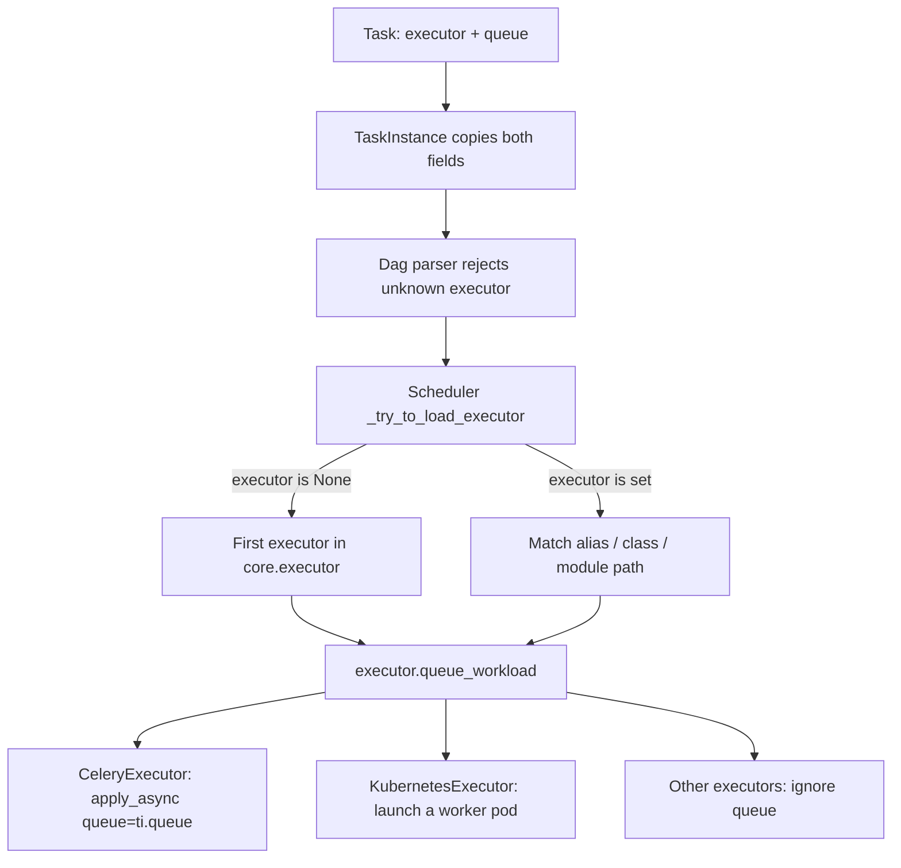

# Executor routing during migration

Read this reference only when a copied DAG or helper contains `queue="local"`,
`queue="kubernetes"`, an explicit `executor`, `executor_config`, or custom
Celery queue routing.

## What `queue` and `executor` are

In Airflow 3 these are **two independent fields**. They do not select the same
thing.

| Field | Selects | Used by | If unset |
|---|---|---|---|
| `executor` | Which **execution engine** runs the task | Scheduler (`ti.executor` → `_try_to_load_executor`) | First entry in `[core] executor` — here `CeleryExecutor` |
| `queue` | Which **Celery worker pool** picks the task up | CeleryExecutor (`apply_async(queue=ti.queue)`) | `[operators] default_queue`, then `task_policy` rewrites it to the tier queue |

KubernetesExecutor, LocalExecutor, and similar engines **ignore** `queue`. Only
Celery uses it for routing.

`CeleryKubernetesExecutor` / `LocalKubernetesExecutor` used
`queue="kubernetes"` vs `queue="default"` to pick a **sub-executor**. That
misused `queue` and is **not supported from Airflow 3.0**. Use multi-executor
plus the `executor=` field instead.

| Airflow 2 hybrid (retired) | Airflow 3 |
|---|---|
| `queue="kubernetes"` → K8s sub-executor | `executor="KubernetesExecutor"` |
| `queue="local"` / `"celery"` → Celery | Leave `executor` unset (or `"CeleryExecutor"`) |
| `queue` could not also mean worker pool | `queue` is free for real Celery routing / `task_policy` |

## Current model

The deployment uses `CeleryExecutor,KubernetesExecutor`. Airflow selects an
executor from the task's `executor` field, not from `queue`. With `executor`
unset, Airflow uses the first configured executor (`CeleryExecutor`).

`task_policy` rewrites `queue="local"` and `queue="kubernetes"` to the
DAG-path-derived tier queue. Neither value launches a KubernetesExecutor pod.

## Migration decision

Classify each task by intent instead of mechanically replacing `queue=` with
`executor=`:

- Normal lightweight task: remove the legacy queue and leave `executor` unset.
- Normal task that genuinely needs a dedicated executor pod: remove the legacy
  queue and set `executor="KubernetesExecutor"`.
- `KubernetesPodOperator`: remove the legacy queue and leave `executor` unset.
  KPO runs on Celery and launches its own workload pod; pinning
  KubernetesExecutor creates a redundant executor pod.
- Intentional Celery queue: keep the real queue name. `queue` remains a Celery
  routing field, but it is not an executor selector.

## Pod resource ownership

Configure resources on the pod that actually executes the work:

- A non-KPO task with `executor="KubernetesExecutor"` runs in a dedicated
  executor pod. Use `executor_config["pod_override"]` to configure that pod's
  requests and limits.
- `container_resources` and the KPO's `pod_template_file` configure the actual
  workload pod. Preserve these settings during migration.
- On a KPO, `executor_config["pod_override"]` would configure a
  KubernetesExecutor wrapper pod, not the KPO workload pod. When the KPO runs
  on the default CeleryExecutor, that wrapper does not exist.

When removing a legacy queue from a KPO:

1. Keep its existing workload requests and limits in `container_resources` or
   its pod template.
2. Remove `executor_config["pod_override"]` only when it existed solely to size
   the redundant KubernetesExecutor wrapper.
3. Do not copy wrapper values into `container_resources` mechanically. Resize
   the workload separately only when its own logs or metrics show that it needs
   different resources.

For example, a comment about the "Airflow worker boot" being OOM-killed refers
to the executor wrapper, not automatically to the image launched by KPO.

## Evidence

The behavior was verified on `airflow3-stage` on 2026-08-24 with both a
TaskFlow task using `queue="kubernetes"` and a KPO using `queue="local"`.
Both ran on the tier-0 Celery worker; the KPO separately launched its workload
pod. Recorded run IDs, worker logs, and Kubernetes events are in
`dev_tools/deploy_airflow3_env/reference.md` under **Recorded stage proof**.

The canonical authoring rules are in `airflow_etl/CLAUDE.md` under
**Executors**.
